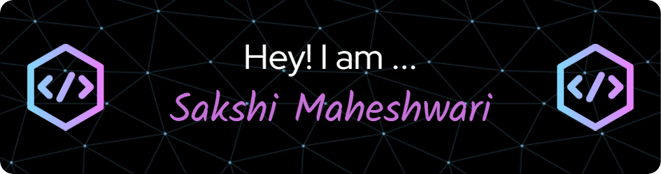

<hr/>
 
 ## Fancy seeing you here! 

I am a Sakshi Maheshwari and currently I am working as a Software Developer in Credit Suisse (NOW UBS). I have done my graduation in Information Technology from [Institute of Engineering and Technology, DAVV](https://www.ietdavv.edu.in/) in 2023. I am a tech enthusiast & loves to excel in the field of technology. Always open to collaborating on projects and innovative/disruptive ideas. Currently looking for full-time SDE roles. Feel free to connect with me here:

[](https://www.linkedin.com/in/sakshimaheshwari1010/)
[](mailto:sakshimaheshwari3141@gmail.com)
[](https://leetcode.com/sakshimaheshwari3141/)
[](https://github.com/sakshimaheshwari3141)

You can find more about me on my [Portfolio](https://sakshiportfolio.netlify.app/). 

<hr/>
 


 
```dart
// tools_I_use organized
class About extends Me { 
  const myTools = {  
    "ProgramingLanguages" : { "Java", "Python", "C++", "C", "Javascript" },
    "OtherLanguages" : { "HTML", "CSS"},
    "Database" : { "Firebase", "MySQL", "MSSQL", "MongoDB" },
    "Editors" : { "Vscode", "PyCharm", "IntelliJ", "Visual Studio" },
    "Platforms" : { "Linux", "Windows" },
    "CSSFrameWorks" : { "MaterialUI", "BootStrap" },
    "OtherTools" : { "Git", "Jira" , "Confluence"}
  };
}
```

---


### :fire: My Stats :


<hr></hr>

<div align="center" >
<br>


</div>


